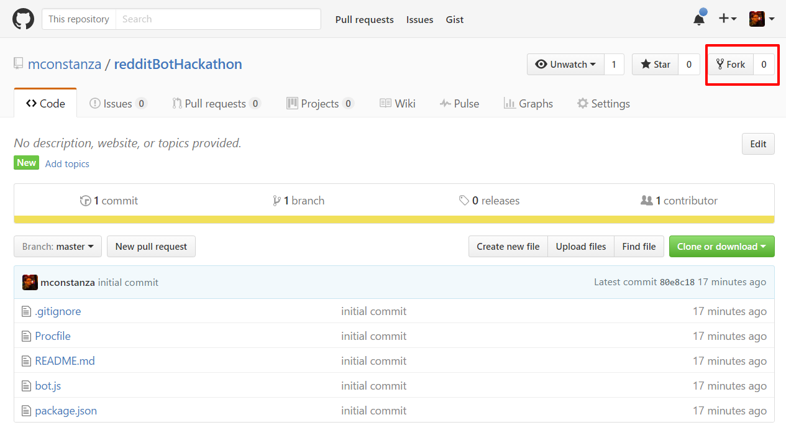
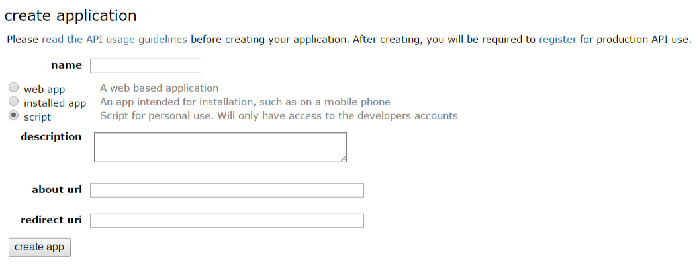
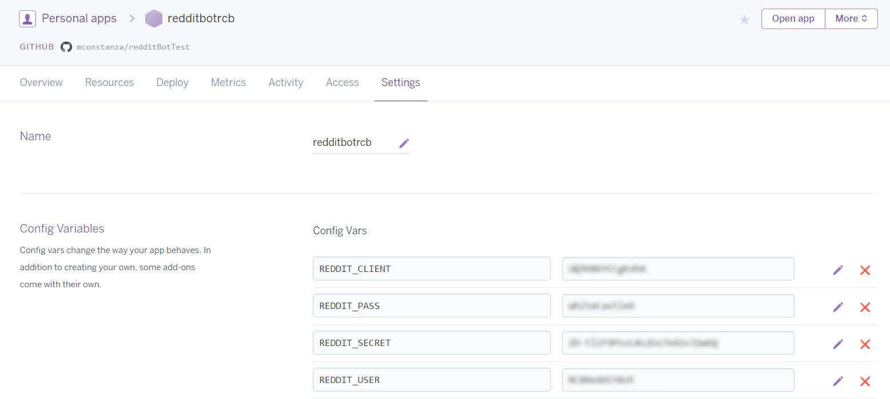
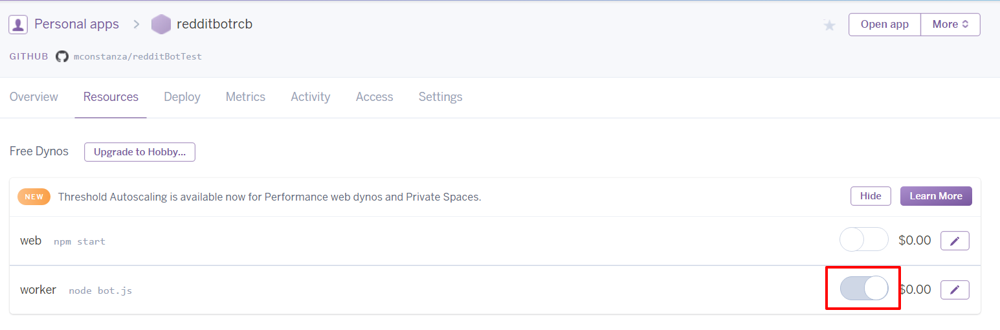

RedditBotTest
=============

Author: MConstanza

A basic Reddit bot that pulls the 'hot' posts from a collection of dev-related subreddits every 60 minutes and reposts them to a [private sub-reddit](https://www.reddit.com/r/RCBRedditBot/).

Setup
=====

Here are the steps you will take to download the starter code and begin working on your own bot:

Go to [my bot repo](https://github.com/mconstanza/redditBotHackathon) and fork a copy of it to your own github account. Then, from your new repo, clone a copy down to your machine.



Set up your heroku. Assuming you already have Heroku CLI tools, you can just go into the root of your application from your bash/command prompt and type 'heroku create APPNAME'. Note the url of your app for the next step. You can later deploy here by git-adding, git-committing, and typing 'git push heroku master'.

[Heroku creation instructions](https://devcenter.heroku.com/articles/creating-apps)

[Create a reddit account](https://www.reddit.com/). If you don't have an account, you will need one to use a bot. If you do have one, you may want to create one just for this bot, as bots are typically users in and of themselves and many people want to keep their reddit usernames private.

Register an application on [Reddit's Dev page](https://ssl.reddit.com/prefs/apps). Name it, write a short description, and select 'script' for the type of bot. The 'about' url should link to your repo and the 'redirect' uri should link to your heroku page. Once you create the app, take note of the client ID and client secret, as you will need them for the next step.



In the root of your app, create a file called 'config.js'. Add your clientId, clientSecret, username, and password as a JSON object to be exported. Example given below.

```javascript
// This file is where all app configuration information will go.
// It should always be placed in .gitignore so that its contents are not visible to others.

let redditConfig =
{ clientId: 'YOUR_ID' ,
  clientSecret: 'YOUR_SECRET',
  username: 'YOUR_USERNAME',
  password: 'YOUR_PASSWORD' }

module.exports = redditConfig;
```

We will use this config file for development and then add ENV variables in heroku for production. NOTE that the gitignore file tells our repo to ignore config.js, so it shouldn't be uploaded when you push. You SHOULD NEVER hard-code your client Secret or user account information in any public repo!

From the root of the app. type 'npm install' to install [snoowrap](https://github.com/not-an-aardvark/snoowrap), the wrapper we will use to access Reddit's API.

You are now ready to begin coding in bot.js!

Deployment
==========

NOTE that you can test your bot from the node console without having to deploy (node bot.js).

A procfile is already set up for you in the repo telling heroku how to use the bot. Note the line of code if you want to understand what is happening.

Deploying is as simple as pushing to heroku, then tweaking a couple settings.

```
git add .
```

```
git commit -m "MESSAGE"
```

```
git push heroku master
```

Add ENV variables: The base code makes use of ENV variables to handle our secure information. In your heroku app settings, click "Reveal Config Vars". Then, add the four variables below and their respecitve values from your config.js



Under 'Resources', make sure 'worker' is switched on.



Check the logs and ensure your bot runs properly.
